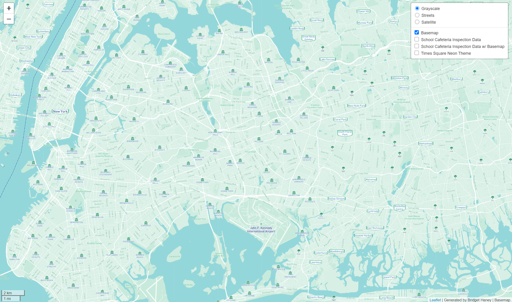

# Visualizations of New York City and surrounding New York Boroughs

## Interactive Map Link

https://bridgethaney.github.io/Map_Design_Tiles

## Map 1. Basemap

### Explanation

This basemap was created in Mapbox and displays the greater New York City area. It includes a light green and blue color scheme with small icons to reflect relevant cities, bouroughs, and smaller neighborhoods.

The area of focus is New York City and surrounding areas.

### Zoom Level

The minimum zoom level is 11.5, while the maximum is 14. This ensures that there is enough detail given in the map without patterns of data or locations disappearing. The 11.5 shows the edge of where the tiles end so that the user can know the extent of the canvas.

## Map 2. School Cafeteria Inspection Data

### Explanation

The map displayed above showcases data involving school cafeteria inspections around the New York City area. It was collected by the Department of Health and Mental Hygiene (DOHMH) of New York and features cafeterias permitted in public, private, and parochial schools. These cafeterias must be in compliance of NYS and NYC Food Safety Regulations. Therefore, this dataset presents which cafeterias follow the protocols or are in violation. The reasons for violation can vary from roaches appearing in the facility to inadequate lighting.

I found this data interesting, as I haven't explored any data like this. The health of students and faculty members of these schools are important, so keeping track of data featuring the following or violation of cafeteria protocols can help to hold schools accountable.

This featured data can be found at this [source](https://data.cityofnewyork.us/Health/DOHMH-School-Cafeteria-inspections/9hxz-c2kj).

The area of focus is New York City and surrounding areas.

### Zoom Level

The minimum zoom level is 11.5, while the maximum is 14. This ensures that there is enough detail given in the map without patterns of data or locations disappearing. The 11.5 shows the edge of where the tiles end so that the user can know the extent of the canvas.

## Map 3. School Cafeteria Inspection Data with Basemap

### Explanation

This map, in particular, combines both the Basemap found in Map 1 and the school cafeteria inspection data of Map 2. It visualizes how basemaps and data layers can work together to find patterns in data within a geographical context. In this case, the geographic focus is on New York City and surrounding areas.

### Zoom Level

The minimum zoom level is 11.5, while the maximum is 14. This ensures that there is enough detail given in the map without patterns of data or locations disappearing. The 11.5 shows the edge of where the tiles end so that the user can know the extent of the canvas.

## Map 4. Special Theme: Times Square Neon

### Explanation

The theme depicted is meant to reflect the bright color scheme found within New York City's top tourist attraction, Times Square. It brings in the feeling of exploring the famous nightlife, including icons above each label that are Times Square themed. For instance, the drama masks are representative of Broadway, while the bridges can represent the known bridges that need to be used to cross into different parts of New York from New York City.

The area of focus is New York City and surrounding areas.

### Zoom Level

The minimum zoom level is 11.5, while the maximum is 14. This ensures that there is enough detail given in the map without patterns of data or locations disappearing. The 11.5 shows the edge of where the tiles end so that the user can know the extent of the canvas.

# Acknowledgement

Used a snippet of code from cmulders on Github to remove white grid line bug that was visible on all browsers for the Map 4. Special Theme: Times Square Neon map. I am also using some snippets of code written by Bo Zhao for GEOG 458 Lab 4.

# Sources

Basemap and Theme Creation: [Mapbox](https://www.mapbox.com/)

School Cafeteria Inspection Data: [NYC OpenData](data.cityofnewyork.us/Health/DOHMH-School-Cafeteria-inspections/9hxz-c2kj)

Lab 4 - Tutorial and Snippets of Code: [GEOG 458 Lab 4](https://github.com/jakobzhao/geog458/tree/master/labs/lab04)

White Grid Line Bug Removal: [cmulders](https://gist.github.com/cmulders/acbbe8a8ff170e34c37b)
