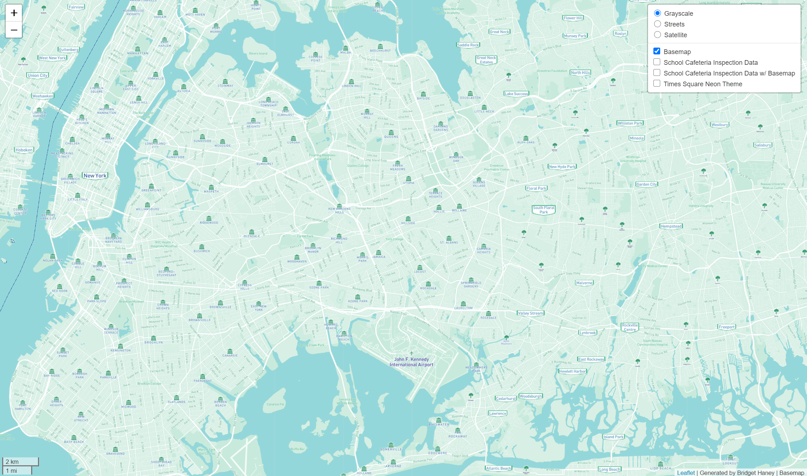

# Visualizations of New York City and surrounding New York Boroughs

### Interactive Map Link

https://bridgethaney.github.io/Map_Design_Tiles

## Map 1. Basemap

### Explanation

This basemap was created in MapBox and displays the greater New York City area. It includes a light green and blue color scheme with small icons to reflect relevant cities, bouroughs, and smaller neighborhoods. 

### Zoom Level

The minimum zoom level is 10, while the maximum is 14. This ensures that there is enough detail given in the map without patterns of data or locations disappearing.

